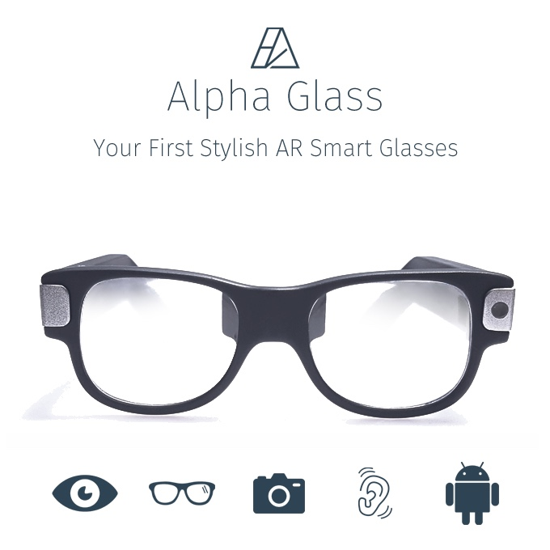
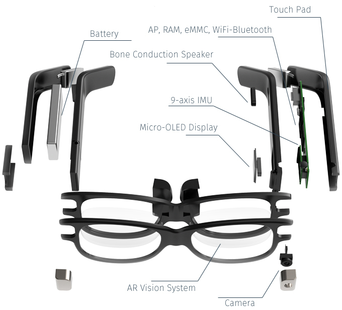

# About Alpha Glass

Alpha Glass are on-lens display AR glasses designed as casual pair of glasses. \
Unlike other AR glasses that have exterior elements, Alpha Glass has an integrated optical system inside the frame.

Augmented Reality(AR) is truly immersive technology that connects real and virtual worlds. \
However, the current products are too big and awkward. \
Alpha Glass solves this problem with custom form factor AR smart glasses, that you can wear anytime, anywhere.

# Features

The official SDK for AlphaGlass is based on Android 5.1 \
Thus developers can develop Alpha glass applications by using standard android API \
Multiple features allow developers to program a variety of applications for users \

Alpha glass support following features

* Cortex A7 Quad core (1.1GHz)
* 2 GB D-Ram
* 16 GB Storage
* 5MP Camera
* 9 Axis Sensor
* 4.0 Bluetooth(BLE)
* Wifi 802.11 b/g/n
* Swipe Touch Pad
* Bone Conduction Speaker
* MEMS Microphone

# Documentation

You can read the [Documentation](https://github.com/TheAlphaLabs/AlphaGlassSDK/wiki) to get how to develop and Alpha glass concept.

# Download

This SDK is under active development. \
The update will be available as soon as the SDK is ready \

# Feedback

We are always happpy to get your feedback \
Please contact us if you have any questions or suggestions for the development of Alpha glass application \
mail me: support@thealphalabs.com \
Also check [TheAlphaLabs](http://www.thealphalabs.com) for more information

# License

Alpha Glass SDK is available under the MIT license. See the LICENSE file for more information.
